```mermaid
erDiagram

    organizaciones {
        bigint      id              PK
        nvarchar    nombre
        bit         activo
    }

    users {
        bigint      id              PK
        nvarchar    name
        nvarchar    email           UK
        nvarchar    role            "super_admin | admin | operador"
        bit         onboarding_visto
        bit         activo
    }

    organizacion_user {
        bigint      id              PK
        bigint      organizacion_id FK
        bigint      user_id         FK
    }

    tipos_vehiculo {
        bigint      id              PK
        bigint      organizacion_id FK
        nvarchar    nombre
        int         peso_min_kg     "peso bruto mínimo"
        int         peso_max_kg     "peso bruto máximo"
        bit         activo
    }

    tipos_servicio {
        bigint      id              PK
        bigint      organizacion_id FK
        nvarchar    nombre          "UK por organización"
        bit         activo
    }

    tipo_servicio_tipo_vehiculo {
        bigint      tipo_servicio_id  PK,FK
        bigint      tipo_vehiculo_id  PK,FK
    }

    zonas {
        bigint      id              PK
        bigint      organizacion_id FK
        bigint      tipo_servicio_id FK "cada zona pertenece a un servicio"
        nvarchar    nombre          "UK por servicio (tipo_servicio_id, nombre)"
        decimal     hectareas       "nullable"
        int         barrios         "nullable"
        int         habitantes      "nullable"
        nvarchar    geojson         "FeatureCollection, nullable"
        decimal     centro_lat      "nullable"
        decimal     centro_lng      "nullable"
        bit         activo
    }

    zona_turnos {
        bigint      zona_id         PK,FK
        nvarchar    turno           PK "string libre, sin catálogo (chips en el modal de zona)"
    }

    zona_horarios {
        bigint      zona_id         PK,FK
        tinyint     dia_semana      PK "1=Lun … 7=Dom"
        tinyint     franja          PK "nro de franja del día"
        time        hora_inicio
        time        hora_fin        "puede cruzar medianoche"
    }

    vehiculos {
        bigint      id              PK
        bigint      organizacion_id FK
        nvarchar    patente         "UK por organización"
        nvarchar    numero_interno  "UK por organización, nullable"
        int         tara_kg         "copiado al pesaje en ingreso"
        bigint      tipo_vehiculo_id FK
        nvarchar    titular
        int         capacidad_kg    "nullable"
        nvarchar    observaciones   "nullable"
        bit         activo
    }

    vehiculos_log {
        bigint      id              PK
        bigint      vehiculo_id     FK
        nvarchar    campo
        nvarchar    valor_anterior  "nullable"
        nvarchar    valor_nuevo     "nullable"
        nvarchar    motivo          "obligatorio"
        bigint      usuario_id      FK
        datetime2   created_at
    }

    pesajes {
        bigint      id              PK
        uniqueid    uuid            UK
        bigint      organizacion_id FK
        bigint      vehiculo_id     FK
        bigint      operador_id     FK
        bigint      tipo_servicio_id FK
        bigint      zona_id         FK
        nvarchar    turno           "nullable"
        int         peso_bruto_kg
        int         peso_tara_kg    "snapshot de tara al ingreso"
        int         peso_neto_kg    "bruto - tara"
        bit         alerta_peso
        nvarchar    observaciones   "nullable"
        nvarchar    estado          "En predio | Cerrado | Cancelado"
        datetime2   hora_salida     "nullable, precisión ms"
        int         bruto_salida_kg "nullable"
        bit         editado
        nvarchar    motivo_cancelacion "nullable"
        bigint      cancelado_por_id FK "nullable"
        datetime2   cancelado_at    "nullable"
    }

    pesajes_log {
        bigint      id              PK
        bigint      pesaje_id       FK
        nvarchar    campo
        nvarchar    valor_anterior  "nullable"
        nvarchar    valor_nuevo     "nullable"
        nvarchar    motivo          "obligatorio"
        bigint      usuario_id      FK
        datetime2   created_at
    }

    alertas {
        bigint      id              PK
        uniqueid    uuid            UK
        bigint      organizacion_id FK
        bigint      user_id         FK "nullable"
        nvarchar    tipo            "peso_fuera_rango | volumen_diario_atipico | gap_registro | frecuencia_zona_atipica"
        nvarchar    titulo
        nvarchar    descripcion     "nullable"
        bigint      pesaje_id       FK "nullable"
        bigint      zona_id         FK "nullable"
        date        fecha_deteccion
        bit         leida
        datetime2   leida_at        "nullable"
    }

    config_alertas {
        bigint      id              PK
        bigint      organizacion_id FK
        nvarchar    tipo            "UK por organización"
        bit         activo
        decimal     umbral_valor    "nullable, significado varía por tipo"
        nvarchar    hora_inicio     "nullable, solo gap_registro"
        nvarchar    hora_fin        "nullable, solo gap_registro"
    }

    reporte_configuraciones {
        bigint      id              PK
        bigint      organizacion_id FK "UK — 1:1 con organización"
        nvarchar    municipalidad_nombre
        nvarchar    intro_empresa   "nullable"
        nvarchar    servicios       "json, nullable"
        bit         ai_enabled
        nvarchar    ai_proveedor
        nvarchar    ai_api_key      "nullable"
        nvarchar    ai_modelo
        nvarchar    ai_prompt       "nullable"
        bit         tipo_informe_mensual_activo
        bit         tipo_alertas_activo
        bit         revision_requerida "default true"
    }

    reportes_programados {
        bigint      id              PK
        bigint      organizacion_id FK
        nvarchar    tipo            "informe_mensual | alertas"
        nvarchar    nombre
        nvarchar    frecuencia      "mensual | semanal | custom"
        nvarchar    cron_expresion
        nvarchar    destinatarios   "json"
        nvarchar    opciones        "json, nullable"
        bit         activo
        datetime2   ultimo_envio_at "nullable"
        datetime2   proximo_envio_at "nullable"
    }

    reporte_destinatarios {
        bigint      id              PK
        bigint      organizacion_id FK
        nvarchar    email           "UK por organización"
        nvarchar    nombre          "nullable"
        int         uso_count
    }

    reportes_generados {
        bigint      id              PK
        bigint      organizacion_id FK
        bigint      usuario_id      FK "nullable"
        bigint      reporte_programado_id FK "nullable"
        nvarchar    origen          "manual | programado"
        nvarchar    tipo            "informe_mensual | alertas"
        nvarchar    formato         "pdf | excel | pdf+excel"
        date        periodo_desde
        date        periodo_hasta
        nvarchar    filtros         "json, nullable"
        nvarchar    destinatarios   "json, nullable"
        nvarchar    estado          "generado | enviado | fallido"
        nvarchar    error           "nullable"
        nvarchar    conclusiones    "narrativa IA, nullable"
        nvarchar    snapshot        "json congelado, nullable"
        bigint      revisado_por_id FK "nullable"
        datetime2   revisado_at     "nullable"
        datetime2   enviado_at      "nullable"
        nvarchar    motivo_descarte "nullable"
    }

    %% ── Multi-tenant: todo cuelga de organizaciones ──────────
    organizaciones      ||--o{  organizacion_user        : "organizacion_id"
    users               ||--o{  organizacion_user        : "user_id"
    organizaciones      ||--o{  tipos_vehiculo           : "organizacion_id"
    organizaciones      ||--o{  tipos_servicio           : "organizacion_id"
    organizaciones      ||--o{  zonas                    : "organizacion_id"
    organizaciones      ||--o{  vehiculos                : "organizacion_id"
    organizaciones      ||--o{  pesajes                  : "organizacion_id"
    organizaciones      ||--o{  alertas                  : "organizacion_id"
    organizaciones      ||--o{  config_alertas           : "organizacion_id"
    organizaciones      ||--o|  reporte_configuraciones  : "organizacion_id (1:1)"
    organizaciones      ||--o{  reportes_programados     : "organizacion_id"
    organizaciones      ||--o{  reporte_destinatarios    : "organizacion_id"
    organizaciones      ||--o{  reportes_generados       : "organizacion_id"

    %% ── Padrón de vehículos ──────────────────────────────────
    tipos_vehiculo      ||--o{  vehiculos                    : "tipo_vehiculo_id"
    tipos_servicio      ||--o{  tipo_servicio_tipo_vehiculo  : "tipo_servicio_id"
    tipos_vehiculo      ||--o{  tipo_servicio_tipo_vehiculo  : "tipo_vehiculo_id"
    vehiculos           ||--o{  vehiculos_log                : "vehiculo_id"
    users               ||--o{  vehiculos_log                : "usuario_id"

    %% ── Configuración de zonas ───────────────────────────────
    tipos_servicio      ||--o{  zonas                    : "tipo_servicio_id"
    zonas               ||--o{  zona_turnos              : "zona_id"
    zonas               ||--o{  zona_horarios            : "zona_id"

    %% ── Pesajes ──────────────────────────────────────────────
    vehiculos           ||--o{  pesajes                  : "vehiculo_id"
    users               ||--o{  pesajes                  : "operador_id"
    users               |o--o{  pesajes                  : "cancelado_por_id"
    tipos_servicio      ||--o{  pesajes                  : "tipo_servicio_id"
    zonas               ||--o{  pesajes                  : "zona_id"
    pesajes             ||--o{  pesajes_log              : "pesaje_id"
    users               ||--o{  pesajes_log              : "usuario_id"

    %% ── Alertas ──────────────────────────────────────────────
    users               |o--o{  alertas                  : "user_id"
    zonas               |o--o{  alertas                  : "zona_id"
    pesajes             |o--o|  alertas                  : "pesaje_id"

    %% ── Reportes ─────────────────────────────────────────────
    reportes_programados |o--o{ reportes_generados       : "reporte_programado_id"
    users                |o--o{ reportes_generados       : "usuario_id / revisado_por_id"
```

# DER — Sistema de Gestión de Balanza
## Infinito Reciclaje × EVOLVERE 2026

**Motor:** SQL Server · **ORM:** Laravel Eloquent · **Versión:** 2.0

> Referencia completa de tipos, constraints, índices y decisiones: [`03-data-model.md`](03-data-model.md).
> El sistema es **multi-tenant**: `organizaciones` es la raíz y casi todas las tablas
> cuelgan de ella vía `organizacion_id`. Por las restricciones de cascadas múltiples de
> SQL Server, las FKs usan `cascadeOnDelete` solo en el camino primario y `noActionOnDelete`
> en el resto (ver sección *Estrategia de borrado*).

---



---

## Cardinalidades

| Relación | Tipo | Notas |
|----------|------|-------|
| `organizaciones` ↔ `users` (vía `organizacion_user`) | N:M | Un usuario puede pertenecer a varias organizaciones; el contexto activo se resuelve en sesión. |
| `organizaciones` → resto de tablas | 1:N | `organizacion_id` en cada tabla. Cascade en el padrón; noAction en operación (ver *Estrategia de borrado*). |
| `organizaciones` → `reporte_configuraciones` | 1:1 | `organizacion_id` con `unique`. Una config de reportes por organización. |
| `tipos_vehiculo` → `vehiculos` | 1:N | noAction en delete. |
| `tipos_servicio` ↔ `tipos_vehiculo` (vía `tipo_servicio_tipo_vehiculo`) | N:M | Un servicio puede sugerir **varios** tipos de vehículo (reemplaza la antigua FK única `tipo_vehiculo_sugerido_id`). |
| `vehiculos` → `vehiculos_log` | 1:N | Audit trail por campo editado. Cascade en delete. |
| `users` → `vehiculos_log` | 1:N | Usuario que editó. noAction. |
| `tipos_servicio` → `zonas` | 1:N | Cada servicio tiene sus propias zonas; una zona pertenece a un único servicio. `tipo_servicio_id` noAction (segundo camino a `organizaciones`). Unique `(tipo_servicio_id, nombre)`. |
| `zonas` → `zona_turnos` | 1:0..N | 0 = sin turno; N = tantos como el admin haya cargado como texto libre para esa zona (sin catálogo). PK `(zona_id, turno)`. Cascade. |
| `zonas` → `zona_horarios` | 1:0..N | Múltiples franjas por día, optativo. PK `(zona_id, dia_semana, franja)`. Cascade. |
| `vehiculos` → `pesajes` | 1:N | noAction en delete. |
| `users` → `pesajes` | 1:N | `operador_id` (registra) + `cancelado_por_id` (nullable, cancela). noAction. |
| `tipos_servicio` → `pesajes` | 1:N | noAction. |
| `zonas` → `pesajes` | 1:N | noAction. |
| `pesajes` → `pesajes_log` | 1:N | Append-only. Cascade en delete. |
| `users` → `pesajes_log` | 1:N | Usuario que editó. noAction. |
| `users` → `alertas` | 1:0..N | Operador destinatario (nullable). noAction. |
| `zonas` → `alertas` | 1:0..N | Nullable. noAction. |
| `pesajes` → `alertas` | 1:0..1 | Un pesaje genera a lo sumo una alerta de peso. noAction. |
| `reportes_programados` → `reportes_generados` | 1:0..N | `nullOnDelete`: al borrar el programado, el historial generado se conserva (queda con FK null). |
| `users` → `reportes_generados` | 1:0..N | `usuario_id` (generó) + `revisado_por_id` (aprobó/descartó). Nullable, noAction. |

---

## Estrategia de borrado (SQL Server)

SQL Server rechaza una FK con `ON DELETE CASCADE` si ya existe otro camino de cascada
hasta la misma tabla desde el mismo ancestro. Como **todo converge en `organizaciones`**,
la regla del proyecto es:

- **Cascade** solo en el camino primario del padrón maestro: `organizaciones → {tipos_vehiculo, tipos_servicio, zonas, vehiculos, alertas, config_alertas, reportes_programados, reporte_destinatarios, reporte_configuraciones}`, `zonas → {zona_turnos, zona_horarios}`, `vehiculos → vehiculos_log`, `pesajes → pesajes_log`.
- **noAction** en toda FK secundaria que también llegaría a `organizaciones`: `tipo_servicio_id` en `zonas` (segundo camino: org → tipos_servicio → zonas), las 5 FKs de `pesajes`, `tipo_vehiculo_id` en `vehiculos`, `usuario_id` en los logs, las FKs nullable de `alertas`, y `organizacion_id`/`usuario_id`/`revisado_por_id` en `reportes_generados`.
- **nullOnDelete** en `reportes_generados.reporte_programado_id` (preserva el historial).

> Detalle y justificación por tabla en [`03-data-model.md`](03-data-model.md) y en `CLAUDE.md` (sección *SQL Server — Reglas de migración*).

---

## Grupos funcionales

```
┌─ MULTI-TENANT ────────────────────────────────────────────┐
│  organizaciones  ←─  organizacion_user  ─→  users          │
│  organizacion_id presente en todas las tablas de dominio   │
└────────────────────────────────────────────────────────────┘

┌─ PADRÓN MAESTRO ──────────────────────────────────────────┐
│  tipos_vehiculo  ←─  vehiculos  ─→  vehiculos_log          │
│  tipos_servicio  ←┬─ tipo_servicio_tipo_vehiculo (N:M)     │
│                   └─ zonas ─┬─ zona_turnos                  │
│                             └─ zona_horarios                │
└────────────────────────────────────────────────────────────┘

┌─ OPERACIÓN ────────────────────────────────────────────────┐
│  pesajes  (vehiculo + servicio + zona + operador + pesos)  │
│  pesajes_log  (audit trail inmutable)                      │
└────────────────────────────────────────────────────────────┘

┌─ ALERTAS ──────────────────────────────────────────────────┐
│  alertas  (zona | pesaje | user)                           │
│  config_alertas  (umbrales, toggles y horario operativo)   │
└────────────────────────────────────────────────────────────┘

┌─ REPORTES ─────────────────────────────────────────────────┐
│  reporte_configuraciones  (marca + IA + revisión, 1:1 org) │
│  reportes_programados  ──→  reportes_generados (historial) │
│  reporte_destinatarios  (libreta de emails con frecuencia) │
└────────────────────────────────────────────────────────────┘

┌─ ACCESO ───────────────────────────────────────────────────┐
│  users  (super_admin · admin · operador)                   │
└────────────────────────────────────────────────────────────┘
```

---

*Diagrama actualizado: 18/06/2026 · v2.0 — multi-tenant, módulo de reportes y alertas. Referencia completa: [`03-data-model.md`](03-data-model.md)*
