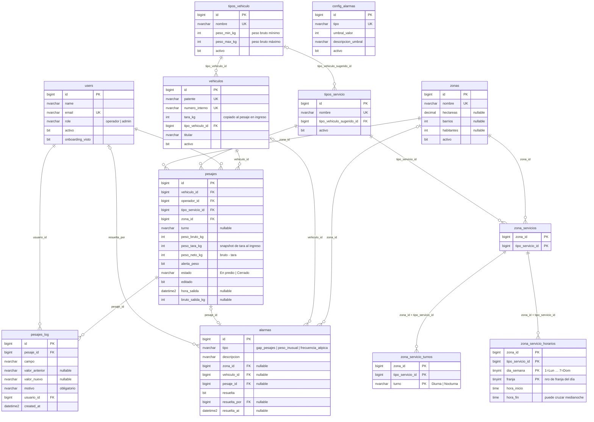

# DER — Sistema de Gestión de Balanza
## Infinito Reciclaje × EVOLVERE 2026

**Motor:** SQL Server · **ORM:** Laravel Eloquent · **Versión:** 1.1

---



---

## Cardinalidades

| Relación | Tipo | Notas |
|----------|------|-------|
| `tipos_vehiculo` → `vehiculos` | 1:N | Un tipo tiene muchos vehículos. RESTRICT en delete. |
| `tipos_vehiculo` → `tipos_servicio` | 1:0..N | Sugerencia nullable. SET NULL en delete. |
| `zonas` ↔ `tipos_servicio` (vía `zona_servicios`) | N:M | Una zona opera bajo varios servicios; un servicio opera en varias zonas. |
| `zona_servicios` → `zona_servicio_turnos` | 1:0..N | 0 = sin turno; 1 = solo Diurna o solo Nocturna; 2 = ambos. |
| `zona_servicios` → `zona_servicio_horarios` | 1:0..N | Múltiples franjas por día, optativo. |
| `vehiculos` → `pesajes` | 1:N | RESTRICT en delete. |
| `users` → `pesajes` | 1:N | Operador que registra. RESTRICT en delete. |
| `tipos_servicio` → `pesajes` | 1:N | RESTRICT en delete. |
| `zonas` → `pesajes` | 1:N | RESTRICT en delete. |
| `pesajes` → `pesajes_log` | 1:N | Append-only. RESTRICT en delete. |
| `users` → `pesajes_log` | 1:N | Usuario que editó. RESTRICT en delete. |
| `zonas` → `alarmas` | 1:0..N | Nullable. SET NULL en delete. |
| `vehiculos` → `alarmas` | 1:0..N | Nullable. SET NULL en delete. |
| `pesajes` → `alarmas` | 1:0..1 | Un pesaje genera a lo sumo una alarma de peso inusual. |
| `users` → `alarmas` | 1:0..N | Admin que resolvió. Nullable. RESTRICT en delete. |

---

## Grupos funcionales

```
┌─ PADRÓN MAESTRO ──────────────────────────────────────────┐
│  tipos_vehiculo  ←─  vehiculos                            │
│  tipos_vehiculo  ←─  tipos_servicio                       │
│  zonas  ──────────── zona_servicios ─── zona_servicio_turnos
│                                    └─── zona_servicio_horarios
└────────────────────────────────────────────────────────────┘

┌─ OPERACIÓN ────────────────────────────────────────────────┐
│  pesajes  (vehiculo + servicio + zona + operador + pesos)  │
│  pesajes_log  (audit trail inmutable)                      │
└────────────────────────────────────────────────────────────┘

┌─ ALERTAS ──────────────────────────────────────────────────┐
│  alarmas  (zona | vehiculo | pesaje)                       │
│  config_alarmas  (umbrales y toggles)                      │
└────────────────────────────────────────────────────────────┘

┌─ ACCESO ───────────────────────────────────────────────────┐
│  users  (operadores y admins)                              │
└────────────────────────────────────────────────────────────┘
```

---

*Diagrama generado: 14/05/2026 | Referencia completa: [`data-model.md`](data-model.md)*
